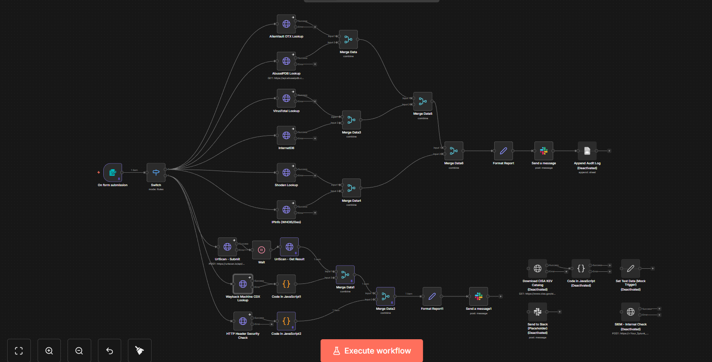
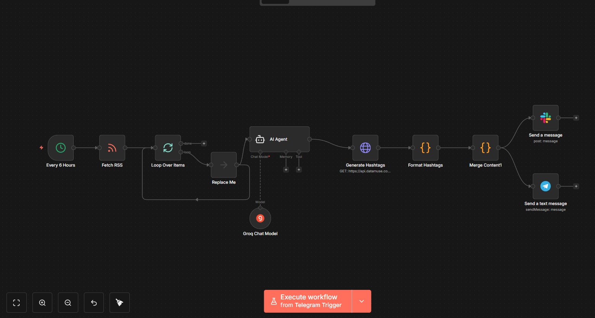

# n8n-automation-lab
My personal library of production-ready n8n workflows. This repo includes AI-powered automations, API pipelines, YouTube tools, and cloud integrations — all designed to save time and simplify complex tasks.

# 🛡️ IP Threat Intelligence Report — n8n Automation

## 📌 Overview

The **IP Threat Intelligence Report** is an automated security intelligence workflow built using **n8n**.  
Given an IP address, the workflow queries multiple OSINT and security data sources in parallel, enriches the data, merges the results, and generates a **single structured threat report**.

This project is designed for:

- 🔍 Security Analysts  
- 🛡️ SOC Teams  
- 🧠 Threat Hunters  
- 🚨 Incident Responders  

Submit an IP — and the workflow does the investigation automatically 🚀

---

## ⚙️ Workflow Architecture

### **1️⃣ Trigger — IP Submission**
The workflow begins when an IP address is submitted through a form trigger.

### **2️⃣ Threat Intelligence Lookups (Parallel Execution)**

The IP address is queried across multiple intelligence platforms, including:

| Source | Purpose |
|--------|--------|
| 🌐 AlienVault OTX | Community OSINT threat intel |
| 🧪 VirusTotal | Malware, detection, sandbox data |
| 🚨 AbuseIPDB | Abuse & malicious activity reports |
| 🔎 Shodan | Internet-facing service fingerprinting |
| 🌍 InternetDB | Fast IP risk enrichment |
| 🧾 WHOIS Lookup | Ownership & registry data |
| 🛰️ URLScan | Website scan intelligence |
| 🕰️ Wayback Machine | Historical website snapshots |
| 🛡️ Header Security Check | Security header analysis |

This wide surface increases confidence and context when investigating IPs.

---

### **3️⃣ Data Merge & Normalization**

Each result is:

✔ parsed  
✔ structured  
✔ combined  

into a unified intelligence dataset.

This avoids duplicate or conflicting data, making the report clean and analyst-friendly.

---

### **4️⃣ Report Generation**

A formatter node converts the combined data into a readable report that may include:

- Reputation score & risk indicators
- Abuse confidence ratings
- DNS & passive lookup data
- Open ports & fingerprints
- Malware associations
- WHOIS ownership details
- OSINT presence & sightings
- Web presence & history
- Security headers

---

### **5️⃣ Notification / Logging (Optional)**

The workflow may:

📩 Send alerts (e.g., Slack)  
🗂 Append audit logs  
📜 Store report history  

These components are modular and can be customized.

---

## 📊 Real-World Use Cases

✔ Investigate suspicious traffic  
✔ Validate IP block decisions  
✔ Support SOC triage  
✔ Assist incident response  
✔ Enrich SIEM alerts  
✔ Threat hunting  
✔ Security research  

---

## 🧩 Technology Stack

| Tool | Role |
|------|------|
| **n8n** | Core automation engine |
| **Multiple OSINT APIs** | Threat intelligence |
| **Merge / Transform Nodes** | Data enrichment |
| **Slack (optional)** | Notifications |

---

## 🔐 Security Notice

This repository **does not include any credentials or API keys.**

You must configure your own credentials in n8n.

# 📰 Social Media Automation – Text Generation (n8n)

## 📌 Overview
This project is an automated cybersecurity news bot built using **n8n + Groq AI**.  
Every 6 hours, the workflow fetches cybersecurity news from RSS feeds, summarizes each article using AI, generates relevant hashtags, and posts the update to **Slack and Telegram**.

Ideal for security teams, awareness channels, and tech communities.

## 🧠 Key Features
- ⏱ Scheduled execution every 6 hours  
- 🤖 AI-generated summaries  
- 🏷 Automatic hashtag creation  
- 🧹 Clean formatted messages  
- 📣 Publishes to Slack & Telegram  
- 🔁 Loops through each RSS article  

## 🏗 Workflow Steps
1. Trigger — Every 6 hours  
2. Fetch cybersecurity RSS feed  
3. Loop through each article  
4. AI summarizes the story  
5. Hashtags are generated  
6. Content is formatted  
7. Message is published to Slack & Telegram  

## 📲 Example Output
🛡 Cybersecurity Update

**Title:** …  
**Summary:** …  
**Source:** …  

#cybersecurity #infosec #threathunting  

## 🧩 Tech Stack
- n8n  
- Groq AI  
- RSS Feeds  
- Slack API  
- Telegram API  

## 🔐 Security
No credentials or API keys are stored in this repo.  
Configure secrets securely inside n8n.

## 🚀 Usage
1. Import the workflow JSON  
2. Add your credentials  
3. Activate the workflow  
4. Done 🎯  

